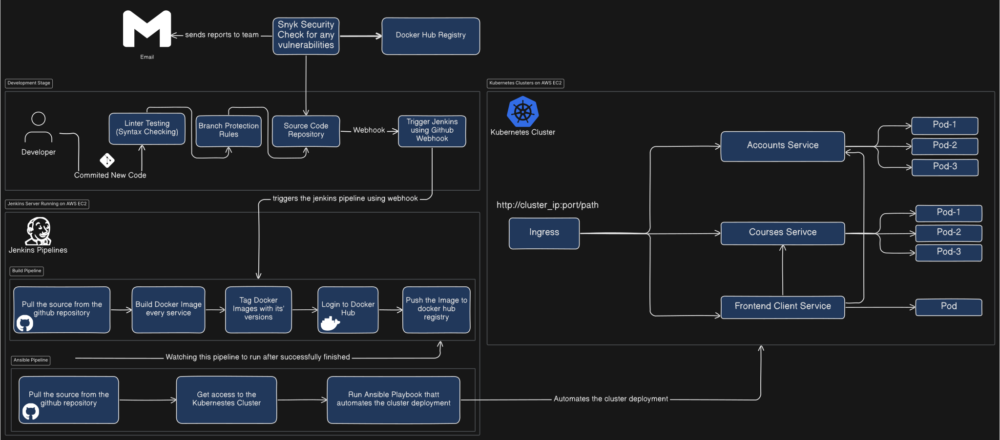

# Online Learning Platform Deployment Pipeline

## Table of Contents

-   [Overview](#overview)
-   [Diagram](#diagram)
-   [Architecture](#architecture)
-   [Development Stage](#development-stage)
-   [CI/CD Pipeline](#cicd-pipeline)
    -   [Jenkins Build Pipeline](#jenkins-build-pipeline)
    -   [Ansible Pipeline](#ansible-pipeline)
-   [Kubernetes Deployment](#kubernetes-deployment)
    -   [Cluster Services](#cluster-services)
-   [Security](#security)

## Overview

The online learning platform is built with a microservices architecture and deployed using continuous integration/continuous deployment (CI/CD) pipelines. The services are containerized and orchestrated using Kubernetes clusters hosted on AWS EC2 instances.

## Diagram

The following diagram illustrates the complete CI/CD pipeline setup that involves source code management, Jenkins automation, Docker image building, ansible playbook, and kubernetes cluster:

## Architecture

The architecture consists of the following key components:

-   **Source Code Management (SCM):** The platform’s code is hosted in a source code repository (e.g., GitHub).
-   **CI/CD Tools:** Jenkins is used for automating the build and deployment process. Ansible is utilized to configure and deploy Kubernetes clusters.
-   **Security Scanning:** Vulnerability scanning of Docker images is performed using Snyk.
-   **Docker Hub Registry:** Used to store and manage Docker images for the platform's services.
-   **Kubernetes Cluster:** The platform's services are deployed on Kubernetes, which provides scalability and resilience.

## Development Stage

1. **Developer Commits Code:** A developer commits new code to the source code repository.
2. **Linter Testing:** The code undergoes syntax checking to ensure quality.
3. **Branch Protection:** Rules are enforced to protect key branches.
4. **Webhook Trigger:** Upon committing new code, a webhook triggers the Jenkins pipeline.

## CI/CD Pipeline

The deployment pipeline is divided into two stages: the **Build Pipeline** and the **Ansible Pipeline**.

### Jenkins Build Pipeline

1. **Source Code Retrieval:** Jenkins pulls the latest code from the GitHub repository.
2. **Build Docker Images:** Docker images for each microservice (e.g., Accounts, Courses, and Frontend Client) are built.
3. **Tag Docker Images:** Each Docker image is tagged with a specific version.
4. **Login to Docker Hub:** Jenkins logs into Docker Hub to push the built images.
5. **Push Images:** The Docker images are pushed to the Docker Hub registry for storage and further use in deployment.

### Ansible Pipeline

After the build pipeline successfully completes, the Ansible pipeline is triggered:

1. **Source Retrieval:** The Ansible pipeline pulls the necessary source files from the GitHub repository.
2. **Kubernetes Cluster Access:** Ansible obtains access to the Kubernetes cluster based on environment configurations.
3. **Ansible Playbook Execution:** The playbook automates the deployment of the services into the Kubernetes cluster.

## Kubernetes Deployment

Once the pipeline stages are complete, the platform is deployed into the Kubernetes clusters hosted on AWS EC2 instances.

### Cluster Services

-   **Ingress:** Exposes services to external users by routing HTTP requests.
-   **Accounts Service:** Handles user accounts and authentication, replicated across three pods for high availability.
-   **Courses Service:** Manages course content and interactions, also replicated across three pods.
-   **Frontend Client Service:** Serves the user-facing part of the platform, running on a single pod.

Each service is deployed in its own pod(s), and traffic to the services is routed via the Ingress component.

## Security

Security is a key aspect of this deployment process. The following measures are implemented:

-   **Snyk Vulnerability Scanning:** Before pushing the Docker images to the registry, a security scan is performed to identify any vulnerabilities.
-   **Email Notifications:** The team is notified via email in case vulnerabilities are found.

---

This provides a comprehensive overview of the online learning platform's deployment pipeline. Each stage of the pipeline is automated to ensure smooth and reliable deployments.
